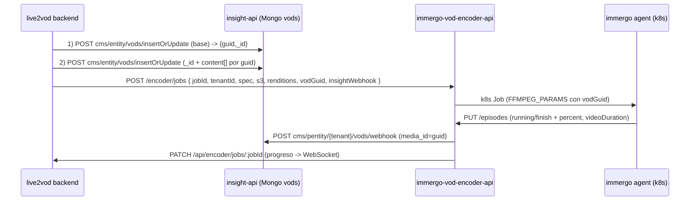

# Integración Live2VOD nuevo ↔ insight-api ↔ immergo encoder

Describe cómo el BFF (`insight-cms-live2vod/backend`) crea el VOD en Mongo de insight-api (como el legacy) y despacha el encode a `immergo-vod-encoder-api`, que produce HLS multi-rendición + `master.m3u8` y notifica el avance a insight-api y al BFF.

Ver los contratos legacy completos en `insight-api/LIVE2VOD-CONTRACTS.md` (mismo doc en `insight-cms`).

## Flujo



## Creación del VOD (BFF → insight-api)

`backend/src/services/insight-vod.service.js` → `createInsightVod({ accountId, tenantId, spec, s3, renditions })`:

1. `POST {INSIGHT_API_BASE}/cms/entity/vods/insertOrUpdate` con el doc base (`title`, `description`, `keywords`, `accountId`, `publish_status:"pending"`, `vodType:"clip"`, poster en `content[]` si el editor lo provee). Headers: `Authorization: Bearer {token}`, `x-tenant-id: {tenant}`. La respuesta trae `guid` y `_id`.
2. Calcula `content[]` con el `guid` y el layout S3 legacy (ver abajo) y hace un segundo `insertOrUpdate` con `_id` para persistir `content[]`.
3. Devuelve `{ vodId, guid }`.

> Se usa `insertOrUpdate` (no `createClip`) para NO disparar el transcoding interno de insight-api. El encode lo hace immergo.

## Perfiles de encodeo (videoProfiles)

`backend/src/services/video-profiles.service.js` → `resolveTenantVideoProfiles({ accountId, tenantId })`:

- Consulta `videoProfiles` en insight-api por `accountId` (igual que legacy `createClip`).
- Si no hay perfiles, usa los defaults de `environment.renditions` (`640x360`, `960x540`, `1280x720`).
- Se envían al encoder en `POST /encoder/jobs` como `renditions[]`.

## Layout S3 legacy (compartido BFF ↔ agent)

`backend/src/services/vod-output-layout.js` — **mismo layout que insight-api createClip**:

```
base   = {cdnBase}/{customerFolder}/transcoded/{guid}
master = {base}/hls/master.m3u8        (content hls, default:true)
mp4    = {base}/{res}_{guid}.mp4       (content mp4, uno por rendición)
poster = {base}/poster.jpg            (content Poster H)
hls    = {base}/hls/{bitrate}/streamPlaylist.m3u8 + segmentos
```

- `customerFolder` = tenant id (o override de `storageProviders[].folderOrBucket` cuando `useProviderBucket`).
- `guid` es la clave compartida: `media_id` del webhook legacy, segmento S3 y base de las URLs de `content[]`.
- El agent sube con `output = {customerFolder}/transcoded` + `vodGuid = guid` (equivalente legacy a `output + origin_id`).

## Payload a `POST /encoder/jobs`

`backend/src/services/vod-encode-runner.service.js`:

```jsonc
{
  "jobId": "uuid",
  "tenantId": "tenant",
  "spec": { /* EditorStateJson */ },
  "editorClipId": "opcional",
  "s3": {
    "bucket", "key", "secret", "hostname", "cdnBase",
    "customerFolder", "output": "{customerFolder}/transcoded"
  },
  "renditions": [ /* videoProfiles del tenant */ ],
  "vodGuid": "{guid del VOD en Mongo}",
  "insightWebhook": {
    "url": "{INSIGHT_API_BASE}/cms/pentity/{tenant}/vods/webhook",
    "mediaId": "{guid}",
    "headers": { "x-tenant-id": "{tenant}" }
  }
}
```

## Subtítulos Whisper (OpenAI STT)

Cuando el editor activa `subtitleMode`, el `spec` incluye `clips[].subtitles`:

```jsonc
{
  "enabled": true,
  "burnIn": false,
  "whisperSourceLanguage": "auto",
  "whisperOutputLanguage": "same",
  "style": { "fontSizePx": 28, "textColor": "#FFFFFF", "outlineColor": "#000000", "outlineWidthPx": 3 },
  "transcribeSpeakerDiarization": true,
  "transcribeInferSpeakerNames": false
}
```

- `burnIn: false` (default): STT + sidecar HLS + entry `Subtitles` en Mongo (`subs_whisper.vtt`).
- `burnIn: true`: además quema subtítulos en el mezzanine antes de las renditions.

El BFF pre-crea `content[]` con `assetTypes: ["Subtitles"]` apuntando a `{base}/hls/subs_whisper.vtt`.

Ver deploy/env en `immergo-vod-encoder-api/docs/WHISPER-SUBTITLES.md`.

## Notificación de avance

- El encoder hace `PATCH /api/encoder/jobs/:jobId` al BFF (igual que hoy) → `vod-jobs.store` → WebSocket `/api/ws/vod`.
- El encoder hace `POST {insightWebhook.url}` (contrato legacy, `media_id = guid`) para actualizar el VOD en Mongo (`percent`, `publish_status`, `video_duration`). Así insight-cms muestra el avance como en legacy.
