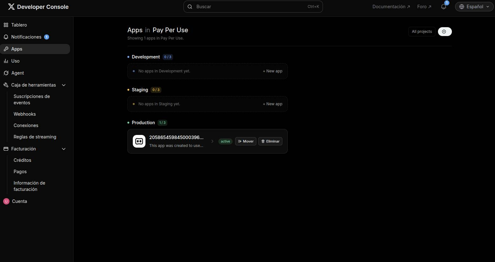
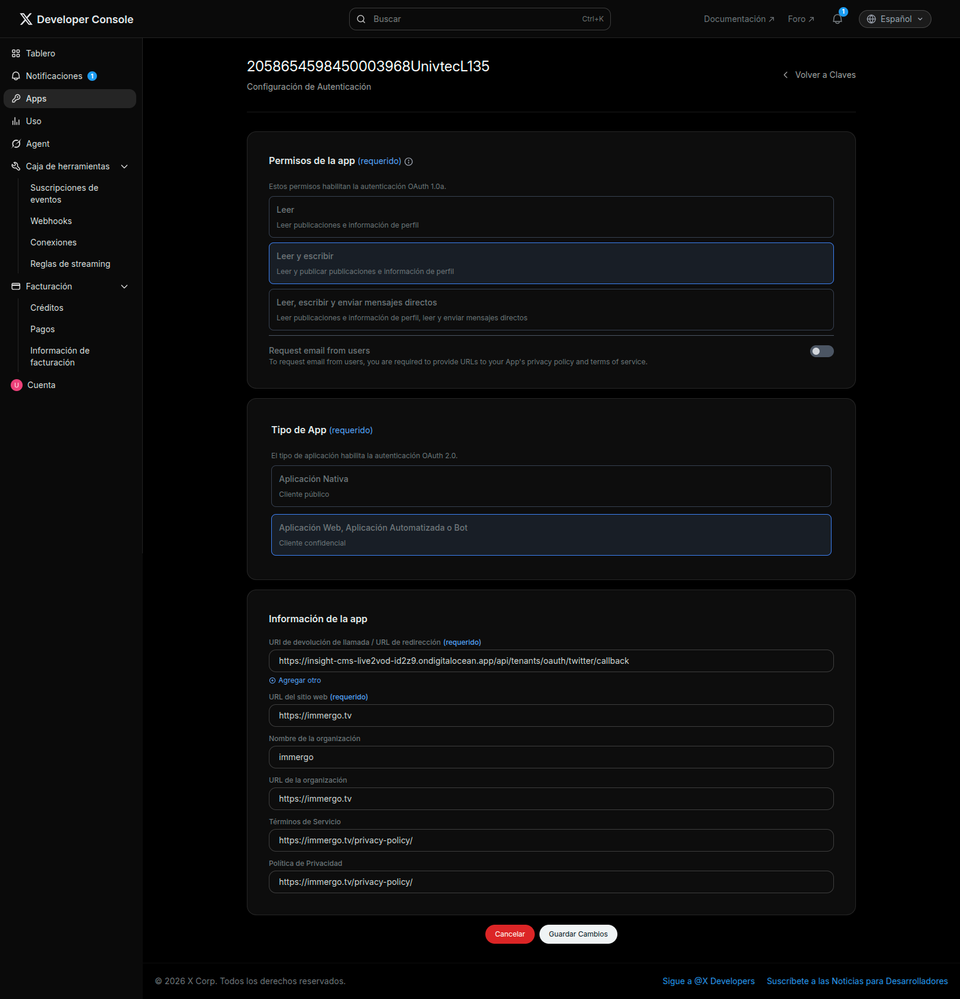
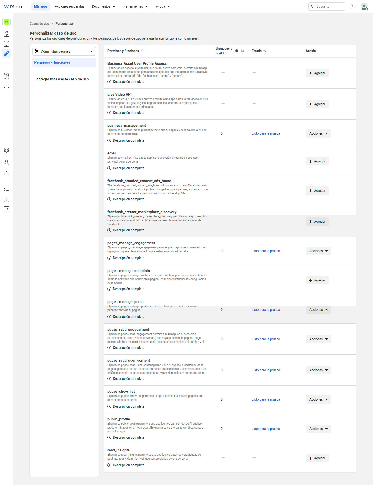
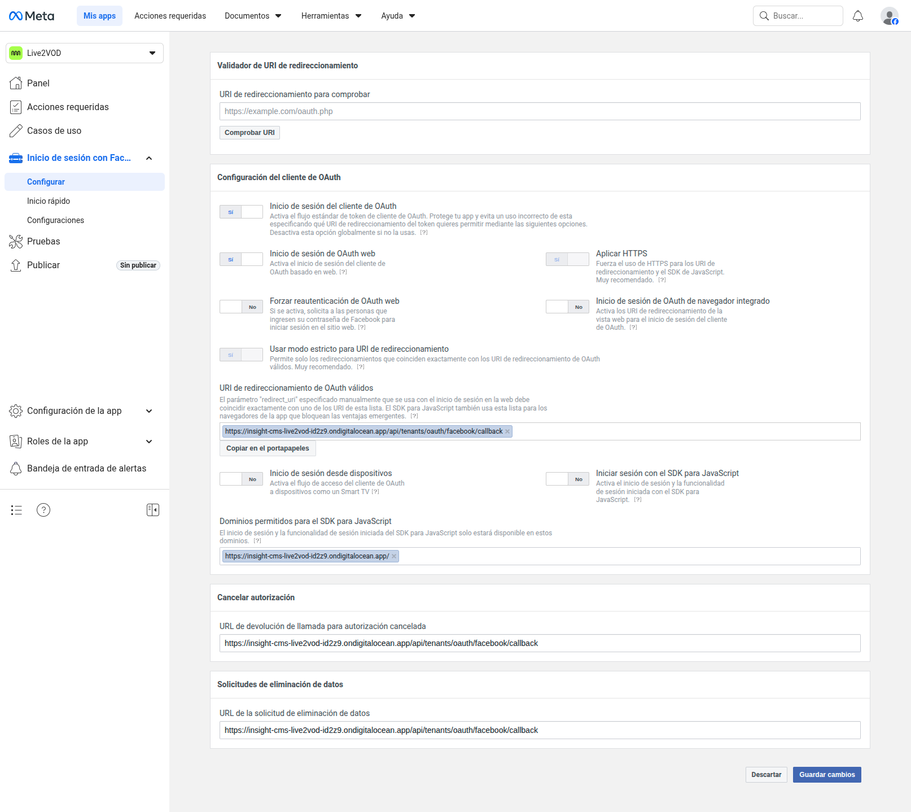
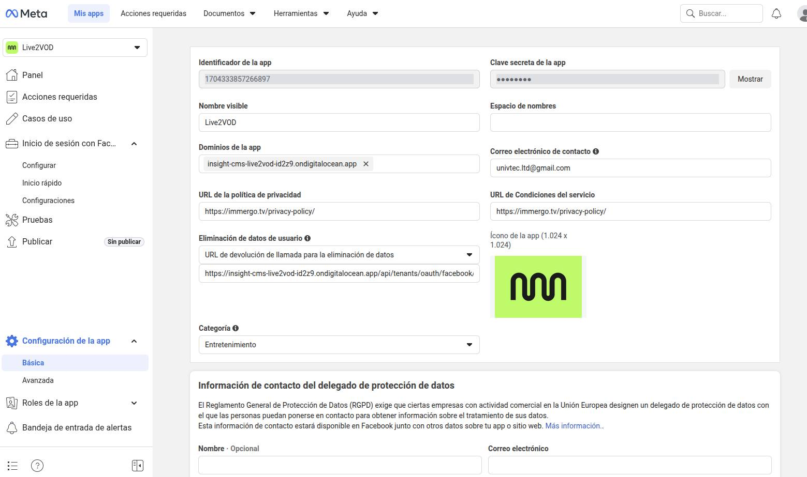

# Syndication Config Guide

Esta guía explica, paso a paso, cómo crear y configurar las apps de cada red social para la sindicación en este proyecto.

Orden cubierto:
1. YouTube
2. X
3. Facebook
4. Instagram
5. TikTok

---

## Requisitos generales (aplican a todas)

- Tener backend público con HTTPS.
- Definir una URL base del backend, por ejemplo:
  - Producción: `https://TU_BACKEND`
  - Local con túnel HTTPS (si aplica): `https://TU_TUNEL`
- Los callbacks OAuth de este proyecto son:
  - YouTube: `https://TU_BACKEND/api/tenants/oauth/youtube/callback`
  - X: `https://TU_BACKEND/api/tenants/oauth/twitter/callback`
  - Facebook: `https://TU_BACKEND/api/tenants/oauth/facebook/callback`
  - Instagram: `https://TU_BACKEND/api/tenants/oauth/instagram/callback`
  - TikTok: `https://TU_BACKEND/api/tenants/oauth/tiktok/callback`
- Este proyecto está diseñado para administrar OAuth principalmente desde:
  - `Admin -> Settings -> Syndication -> <Red>` (fuente principal para operación)
- Las variables de entorno del backend (`backend/.env`) se usan como fallback operativo o bootstrap inicial.
- Regla de prioridad: si hay valor en Admin Settings (BD), ese valor pisa el `.env`.

## Consolas de desarrollador (links directos)

- YouTube / Google Cloud Console: [https://console.cloud.google.com/](https://console.cloud.google.com/)
- X Developer Portal: [https://developer.x.com/en/portal/dashboard](https://developer.x.com/en/portal/dashboard)
- X Developer Console (vista de apps): [https://console.x.com/](https://console.x.com/)
- Meta for Developers (Facebook/Instagram): [https://developers.facebook.com/apps/](https://developers.facebook.com/apps/)
- TikTok Developer Portal: [https://developers.tiktok.com/](https://developers.tiktok.com/)

---

## 1) YouTube

### 1.1 Crear app en Google Cloud

Consola oficial:

- [https://console.cloud.google.com/](https://console.cloud.google.com/)

1. Ir a Google Cloud Console y crear/select project.
2. Habilitar YouTube Data API v3.
3. Crear OAuth Client ID tipo Web Application.
4. En Authorized redirect URIs, agregar:
   - `https://TU_BACKEND/api/tenants/oauth/youtube/callback`
5. Guardar `Client ID` y `Client Secret`.

### 1.2 Scopes que usa este backend

- `https://www.googleapis.com/auth/youtube.upload`
- `https://www.googleapis.com/auth/youtube.readonly`

### 1.3 Configurar en este sistema

Configurar primero en `Admin -> Settings -> Syndication -> YouTube`:

- `YOUTUBE_CLIENT_ID`
- `YOUTUBE_CLIENT_SECRET`
- `YOUTUBE_REDIRECT_URI`

Variables opcionales:

- `YOUTUBE_OAUTH_FRONTEND_REDIRECT`
- `YOUTUBE_OAUTH_STATE_SECRET`

Fallback por `.env` (solo si no se carga en Admin):

- `YOUTUBE_CLIENT_ID`
- `YOUTUBE_CLIENT_SECRET`
- `YOUTUBE_REDIRECT_URI`

### 1.4 Conectar tenant

1. En editor/tenant, abrir Syndication y conectar YouTube.
2. Flujo interno usado por el frontend/backend:
   - GET `/api/tenants/:tenantId/syndication/youtube/auth-url`
   - Callback en `/api/tenants/oauth/youtube/callback`
3. Verificar estado conectado en el tenant.

---

## 2) X (Twitter)

### 2.1 Crear app en X Developer Portal

Sitios que vas a usar:

- Portal: [https://developer.x.com/en/portal/dashboard](https://developer.x.com/en/portal/dashboard)
- Configuración de app/proyecto: [https://developer.x.com/en/portal/projects-and-apps](https://developer.x.com/en/portal/projects-and-apps)
- Vista de apps (referencia visual del entorno actual): [https://console.x.com/accounts/2058654598450003968/apps](https://console.x.com/accounts/2058654598450003968/apps)

Referencia de la pantalla de configuración OAuth de X (la de tu captura):

- `Permisos de la app`: seleccionar `Leer y escribir` para habilitar publicación.
- `Tipo de App`: seleccionar `Aplicación Web, Aplicación Automatizada o Bot` (cliente confidencial).
- `URI de devolución de llamada / URL de redirección`: aquí se carga el callback del backend, exactamente:
  - `https://TU_BACKEND/api/tenants/oauth/twitter/callback`
- `URL del sitio web`: URL pública de tu frontend/admin (por ejemplo `https://immergo.tv`).
- `Términos de Servicio` y `Política de Privacidad`: URLs válidas de tu sitio (requeridas para el flujo OAuth completo).

Importante: la `redirect URI` de esta pantalla debe coincidir exactamente con la que configuras en Admin (`TWITTER_REDIRECT_URI`), sin diferencias de slash, dominio o protocolo.

Paso a paso dentro del portal:

1. Entrar en `https://developer.x.com/en/portal/dashboard` con la cuenta dueña de la app.
2. Ir a `Projects & Apps` y crear un `Project` (si no tenés uno).
3. Dentro del proyecto, crear una `App`.
4. Abrir la app y entrar a `User authentication settings` (OAuth 2.0).
5. Habilitar `OAuth 2.0` y elegir tipo `Web App`.
6. En `App permissions`, seleccionar lectura/escritura (Read and Write).
7. En `Callback URI / Redirect URI`, agregar exactamente:
   - `https://TU_BACKEND/api/tenants/oauth/twitter/callback`
8. En `Website URL`, poner la URL del frontend/admin (por ejemplo `https://TU_FRONTEND`).
9. Guardar cambios.
10. En `Keys and tokens`, copiar:
    - `Client ID`
    - `Client Secret`
11. Confirmar que la app quedó asociada al proyecto correcto y en estado activo.

Notas importantes:

- El redirect URI debe coincidir carácter por carácter con el valor configurado en el CMS.
- Si cambiaste app/proyecto, reconectar el tenant para regenerar refresh token.

### 2.2 Scopes que usa este backend

- `tweet.read`
- `tweet.write`
- `users.read`
- `offline.access`
- `media.write`

### 2.3 Configurar en este sistema

Configurar primero en `Admin -> Settings -> Syndication -> Twitter / X`:

- `TWITTER_CLIENT_ID`
- `TWITTER_CLIENT_SECRET`
- `TWITTER_REDIRECT_URI`

Variables opcionales:

- `TWITTER_OAUTH_FRONTEND_REDIRECT`
- `TWITTER_OAUTH_STATE_SECRET`

Fallback por `.env` (solo si no se carga en Admin):

- `TWITTER_CLIENT_ID`
- `TWITTER_CLIENT_SECRET`
- `TWITTER_REDIRECT_URI`

### 2.4 Conectar tenant

1. En el CMS, ir al tenant y abrir `Syndication`.
2. Clic en `Connect X`.
3. Se abrirá el consentimiento de X (sitio `x.com`) y aceptás permisos.
4. X redirige al callback del backend:
   - `https://TU_BACKEND/api/tenants/oauth/twitter/callback`
5. Volver al CMS y confirmar estado `connected`.
6. Recomendado: hacer un encode corto de prueba con syndication X activa.

Flujo técnico:

- Solicitud URL OAuth:
   - GET `/api/tenants/:tenantId/syndication/twitter/auth-url`
- Callback:
  - `/api/tenants/oauth/twitter/callback`

### 2.5 Notas operativas importantes

- X rota refresh token en cada refresh; si queda inválido, reconectar tenant.
- El upload de video usa endpoints v2 nuevos:
  - `POST /2/media/upload/initialize`
  - `POST /2/media/upload/{id}/append`
  - `POST /2/media/upload/{id}/finalize`

---

## 3) Facebook

### 3.1 Crear app en Meta correctamente

Consola oficial:

- [https://developers.facebook.com/apps/](https://developers.facebook.com/apps/)

1. Crear app nueva en Meta Developers (tipo/caso de uso que soporte Pages).
2. No usar una app que solo muestre casos de anuncios o login básico.
3. Agregar caso de uso de contenido/páginas + Facebook Login.
4. Configurar redirect URI:
   - `https://TU_BACKEND/api/tenants/oauth/facebook/callback`

Vista de referencia (caso de uso y permisos de páginas):

Qué validar en esa vista:

- En el selector de caso de uso debe figurar `Administrar páginas`.
- En `Permisos y funciones`, agregar o dejar en estado apto al menos:
  - `pages_show_list`
  - `pages_read_engagement`
  - `pages_manage_posts`
- Para video, sumar también `publish_video` cuando esté disponible para tu app.

### 3.2 Permisos requeridos para este flujo

- `pages_show_list`
- `pages_read_engagement`
- `pages_manage_posts`

Recomendado para video a página:

- `publish_video`

Vista de referencia (configuración OAuth y redirect URI):

Qué completar en esa pantalla:

- Activar `Inicio de sesión del cliente de OAuth` y `Inicio de sesión de OAuth web`.
- En `URI de redireccionamiento de OAuth válidos`, cargar exactamente:
  - `https://TU_BACKEND/api/tenants/oauth/facebook/callback`
- En `Dominios permitidos para el SDK para JavaScript`, cargar tu dominio frontend público.
- Guardar cambios antes de iniciar el flujo de conexión desde el CMS.

Importante: la URL de redirección en Meta debe coincidir exactamente con la que configuras en Admin (`FACEBOOK_REDIRECT_URI`), incluyendo protocolo `https`, dominio y path.

### 3.3 Configurar en este sistema

Configurar primero en `Admin -> Settings -> Syndication -> Facebook`:

- `FACEBOOK_APP_ID`
- `FACEBOOK_APP_SECRET`
- `FACEBOOK_REDIRECT_URI`

Vista de referencia (Meta App ID y App Secret):

Qué tomar de esa pantalla:

- `Identificador de app` -> cargarlo en `FACEBOOK_APP_ID`.
- `Clave secreta de la app` -> cargarla en `FACEBOOK_APP_SECRET`.
- Mantener esos valores alineados con la misma app donde configuraste permisos y redirect URI.

Variables opcionales:

- `FACEBOOK_OAUTH_FRONTEND_REDIRECT`
- `FACEBOOK_OAUTH_STATE_SECRET`

Fallback por `.env` (solo si no se carga en Admin):

- `FACEBOOK_APP_ID`
- `FACEBOOK_APP_SECRET`
- `FACEBOOK_REDIRECT_URI`

### 3.4 Conectar tenant y seleccionar página

1. Conectar Facebook desde Syndication del tenant.
2. Flujo:
   - GET `/api/tenants/:tenantId/syndication/facebook/auth-url`
   - Callback `/api/tenants/oauth/facebook/callback`
3. Luego seleccionar página:
   - GET `/api/tenants/:tenantId/syndication/facebook/pages`
   - POST `/api/tenants/:tenantId/syndication/facebook/select-page` con `pageId`

### 3.5 Requisito de media

- El MP4 de salida debe ser accesible públicamente por Meta (`file_url`).

---

## 4) Instagram

### 4.1 Crear app en Meta

Consola oficial:

- [https://developers.facebook.com/apps/](https://developers.facebook.com/apps/)

1. Usar app de Meta con permisos de Instagram + Pages.
2. Configurar redirect URI:
   - `https://TU_BACKEND/api/tenants/oauth/instagram/callback`

### 4.2 Scopes que usa este backend

- `instagram_basic`
- `instagram_content_publish`
- `pages_show_list`
- `pages_read_engagement`

### 4.3 Configurar en este sistema

Configurar primero en `Admin -> Settings -> Syndication -> Instagram`:

- `INSTAGRAM_APP_ID`
- `INSTAGRAM_APP_SECRET`
- `INSTAGRAM_REDIRECT_URI`

Variables opcionales:

- `INSTAGRAM_OAUTH_FRONTEND_REDIRECT`
- `INSTAGRAM_OAUTH_STATE_SECRET`

Fallback por `.env` (solo si no se carga en Admin):

- `INSTAGRAM_APP_ID`
- `INSTAGRAM_APP_SECRET`
- `INSTAGRAM_REDIRECT_URI`

### 4.4 Conectar tenant y seleccionar cuenta business

1. Conectar Instagram desde Syndication del tenant.
2. Flujo:
   - GET `/api/tenants/:tenantId/syndication/instagram/auth-url`
   - Callback `/api/tenants/oauth/instagram/callback`
3. Luego seleccionar cuenta:
   - GET `/api/tenants/:tenantId/syndication/instagram/accounts`
   - POST `/api/tenants/:tenantId/syndication/instagram/select-account` con `businessAccountId`

### 4.5 Requisitos funcionales

- Cuenta Instagram Business o Creator vinculada a una página de Facebook.
- MP4 de salida accesible públicamente.
- El sistema permite publicar en formato Reels o Feed según configuración por clip.

---

## 5) TikTok

### 5.1 Crear app en TikTok Developer Portal

Consola oficial:

- [https://developers.tiktok.com/](https://developers.tiktok.com/)

1. Crear app y habilitar Login Kit + Content Posting API.
2. Configurar redirect URI:
   - `https://TU_BACKEND/api/tenants/oauth/tiktok/callback`
3. Configurar Domain / URL prefix permitido para subida por URL.

### 5.2 Scopes que usa este backend

- `user.info.basic`
- `video.publish`

### 5.3 Configurar en este sistema

Configurar primero en `Admin -> Settings -> Syndication -> TikTok`:

- `TIKTOK_CLIENT_KEY`
- `TIKTOK_CLIENT_SECRET`
- `TIKTOK_REDIRECT_URI`

Variables opcionales:

- `TIKTOK_OAUTH_FRONTEND_REDIRECT`
- `TIKTOK_OAUTH_STATE_SECRET`

Fallback por `.env` (solo si no se carga en Admin):

- `TIKTOK_CLIENT_KEY`
- `TIKTOK_CLIENT_SECRET`
- `TIKTOK_REDIRECT_URI`

### 5.4 Conectar tenant

1. Conectar TikTok desde Syndication del tenant.
2. Flujo:
   - GET `/api/tenants/:tenantId/syndication/tiktok/auth-url`
   - Callback `/api/tenants/oauth/tiktok/callback`
3. Verificación opcional de creator:
   - GET `/api/tenants/:tenantId/syndication/tiktok/creator-info`

### 5.5 Requisito de media (crítico)

- Publicación usa `PULL_FROM_URL`; el MP4 debe ser HTTP(S) público.
- El dominio/prefijo de esa URL debe estar permitido en TikTok Developer Portal.

---

## Checklist final de validación

1. En Admin Settings, cada red debe figurar con credenciales completas.
2. En cada proveedor, el redirect URI debe coincidir exactamente con backend.
3. Conectar cada red en el tenant.
4. En Facebook/Instagram, completar selección de Page/cuenta business.
5. Ejecutar encode con sindicación y validar estado por clip.
