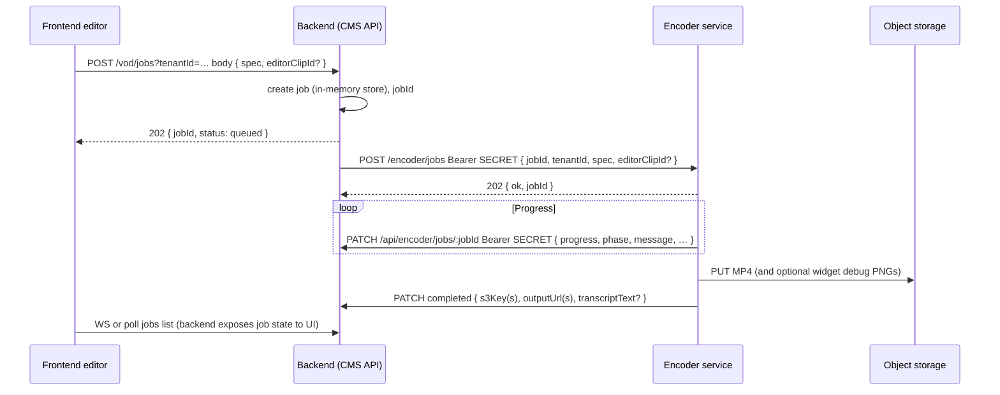

# VOD encoder integration — job payload and ffmpeg mapping

This document describes how the **editor clip JSON** (`EditorStateJson`) produced by the frontend becomes a **VOD encode job** on the backend, how it is **dispatched to an encoder service**, and how the reference implementation (**encoder-lite**) turns that into **ffmpeg** invocations, **optional whisper** steps, and **S3 uploads**. Another encoder vendor can implement the same HTTP contract and interpret the `spec` object without reading the whole codebase.

Canonical TypeScript types for the spec: `frontend/src/types/editor.ts` (`EditorStateJson`, `EditorStateJsonClip`, widgets, posters).

---

## End-to-end flow



1. The **frontend** builds `EditorStateJson` from editor state (see `buildEditorStateJson` / `buildSingleClipEditorStateJson` in `frontend/src/pages/editor.tsx`) and calls `startVodJob(spec, { editorClipId? })` (`frontend/src/services/vod.service.ts`).
2. The **BFF/backend** receives `POST /api/vod/jobs` (or equivalent mount) with `tenantId` as **query** or **`x-tenant-id`**, validates the tenant, requires `spec.clipUrl`, creates a job, and asynchronously **`POST`s the same payload** to the encoder (`backend/src/services/vod-encode-runner.service.js`).
3. The **encoder** accepts the job, runs work (ffmpeg / whisper / upload), and reports state via **`PATCH /api/encoder/jobs/:jobId`** on the backend (`backend/src/controllers/encoder-callback.controller.js`). Only whitelisted patch keys are applied.
4. **Cancel**: backend forwards `POST {ENCODER_SERVICE_URL}/encoder/jobs/:jobId/cancel` with the same Bearer secret.

---

## Authentication

- **Backend → encoder**: `Authorization: Bearer <SECRET>` on `POST /encoder/jobs` and cancel.
- **Encoder → backend**: same `Bearer <SECRET>` on `PATCH /api/encoder/jobs/:jobId`.
- **Backend env** (typical): `ENCODER_SERVICE_URL`, `SECRET` (or alias `ENCODER_SECRET` — see `backend/src/config.js`).
- **Encoder env** (typical): `SECRET` (must match), `BACKEND_BASE_URL` (origin for PATCH), S3 credentials for uploads.

If backend has no encoder URL/secret, the job is marked failed with a configuration error.

---

## HTTP: enqueue job (encoder)

**`POST {encoderBase}/encoder/jobs`**

Headers: `Content-Type: application/json`, `Authorization: Bearer <SECRET>`.

Body (JSON):

| Field | Type | Required | Description |
|--------|------|----------|-------------|
| `jobId` | string | yes | UUID assigned by the backend; must be echoed in all callbacks. |
| `tenantId` | string | yes | Tenant scope for S3 keys and isolation. |
| `spec` | object | yes | Full **VOD spec** (`EditorStateJson`); must include `clipUrl`. |
| `editorClipId` | string | no | Opaque id from the CMS for correlating one output row with the job. |

Response: **`202`** with `{ ok: true, jobId }` (encoder-lite responds before work finishes).

Reject with **400** if `jobId`, `tenantId`, or `spec.clipUrl` is missing.

---

## HTTP: job progress and completion (backend callback)

**`PATCH {BACKEND_BASE_URL}/api/encoder/jobs/:jobId`**

Allowed fields (others ignored): `status`, `progress`, `phase`, `message`, `error`, `s3Key`, `s3Keys`, `outputUrl`, `outputUrls`, `transcriptText`.

Typical `status` values: `processing`, `completed`, `failed`, `cancelled`.  
Typical `phase` values include: `queued`, `encoding`, `transcribing`, `burning_subtitles`, `uploading`, `extracting_audio` (realtime transcribe path), `completed`, `failed`, `cancelled`.

On success, set at least `status: completed`, `progress: 100`, and either `s3Key`/`outputUrl` (single output) or `s3Keys`/`outputUrls` (multiple clips).

---

## The VOD spec (`EditorStateJson`)

This is the **`spec`** object. Times in `clips[]` and `ads[]` are **seconds on the same timeline as `spec.clipUrl`** (see below).

### Root fields

| Field | Meaning |
|--------|---------|
| `clipUrl` | **Primary ffmpeg input URL** (often HLS `.m3u8` with `startTime` / `endTime` query params narrowing the window). |
| `sourceM3u8` | Original playlist URL (informational; encoder may ignore if `clipUrl` is sufficient). |
| `startTime`, `endTime` | **Unix epoch seconds** defining the parent editor window on the wall clock; used by the UI and for ISO timestamps on ads. **Encoder-lite does not subtract these from clip times**; trimming is expected to be reflected in `clipUrl` and in relative `clips` / `ads`. |
| `clips` | Array of output clips; each has `order`, `startTime`, `endTime` **relative to t=0 at the start of the media addressed by `clipUrl`**. |
| `ads` | Ad breaks as `{ startTime, endTime, … }` on the **same relative timeline** as `clipUrl`. Overlapping regions are **removed** from the encoded timeline (gaps skipped), not blacked. |
| `posters` | Poster catalog for the session (optional for encode). |
| `cropWindow` | Legacy global 9:16 crop; prefer `clips[].cropWindow`. |
| `subtitles` | Legacy global whisper config; prefer `clips[].subtitles`. |
| `metadata` | Legacy root metadata. |
| `realtimeTranscribeOnly` | If `true`, **no video encode**: only audio extract + whisper → `transcriptText` (see below). |

### `clipUrl` and the timeline

The frontend builds `clipUrl` with query parameters `startTime` and `endTime` (Unix) when possible (`buildClipWindowUrl` in `editor.tsx`). **All `clips[].startTime` / `endTime` and `ads[]` are expressed in seconds from t=0 at the beginning of that window** (i.e. relative to the encoded slice of the stream, not absolute Unix).

An alternative encoder **must** use the same interpretation: **decode `clipUrl` with ffmpeg**; use **`-ss` / `-to` in seconds** matching each segment’s `[start, end)` on that timeline (after ad subtraction as below).

### `clips[]` (output rows)

Sorted by **`order`** ascending. **One MP4 per clip** in encoder-lite.

Per clip:

- **`startTime` / `endTime`**: Mark-in/out **relative to `clipUrl`’s t=0**, in seconds.
- **`metadata`**: `{ title, description, tags[] }` (metadata for CMS; not required for ffmpeg).
- **`posters`**: optional poster refs for the clip.
- **`cropWindow`**: `{ aspectRatio, centerX }` — for `9:16`, a **vertical strip** crop is applied (`centerX` 0–1).
- **`verticalCropBreakpoints` / `verticalCropPanSettings`**: optional keyframed horizontal pan; implementation splits the clip into sub-segments with different `centerX` / crop.
- **`subtitles`**: `{ enabled, whisperSourceLanguage?, whisperOutputLanguage?, languageMode?, style? }` — if enabled, reference encoder runs **whisper after** the MP4 for that clip and **burns** subtitles.
- **`widgets`**: overlays (text, image, GIF) with normalized layout; see **Widgets and uploads**.

### `ads[]`

Each ad: `startTime`, `endTime` (relative seconds), plus optional `index`, `startProgramDateTime`, `endProgramDateTime` (ISO). Encoder-lite **subtracts** ad intervals from each clip’s `[startTime, endTime]` and encodes only the remaining pieces, then **concat**enates them in order for that clip’s output file.

---

## Mapping spec → ffmpeg (reference: encoder-lite)

Implementation: `encoder-lite/src/services/vod-ffmpeg-encoder.service.js` (`encodeEditorJsonToMp4`), `vod-widget-overlay.service.js`, `vod-encode-runner.service.js`.

1. **ffprobe** `spec.clipUrl` for source width/height (for crop math).
2. For each clip (by `order`):
   - Compute **playable intervals** = clip range minus overlapping **ads**.
   - For each interval, optionally split into **vertical-crop slices** (pan keyframes).
   - For each slice, run **one ffmpeg encode**:
     - **Input**: `spec.clipUrl`.
     - **Time**: `-ss <start> -to <end> -i <clipUrl>` (seconds on the `clipUrl` timeline).
     - **Video**: optional `-vf crop=…` for 9:16 strip (`computeNineSixteenStripCrop`).
     - **Widgets**: if non-empty, build **`-filter_complex`** with extra **`-i`** inputs (PNG/GIF); otherwise plain `-vf` only.
     - **Codecs**: `libx264` + `aac`, `-movflags +faststart` (see source for presets/CRF).
   - **Concat** multiple pieces for the same clip with **ffmpeg concat** demuxer or fallback re-encode.
3. **Outputs**: `localPaths[]` — one file per `clips[]` row (same sort as `order`).

### HTTP(S) inputs

For `https://` inputs, encoder-lite adds **protocol whitelist** and a **User-Agent** (`ffmpegInputGlobalArgs`) so HLS works reliably.

---

## Widgets, images, and uploads

Widgets are listed under **`clips[].widgets`**. Each widget can reference images by:

- **`src`**: absolute URL (`https://…`) or path the encoder can resolve.
- **`storedRelative`**: logical storage key, e.g. `widget-images/…` (S3 raw key) or `posters/{uuid}.ext` (editor poster on disk/API).

**materializeWidgetImageForFfmpeg** (`vod-widget-overlay.service.js`) resolves bytes → temp **PNG** (still) or **GIF** (animated), then ffmpeg composites them.

Optional **debug / CDN**: assembled widget PNGs may be uploaded with **`putWidgetImagePublic`** when S3 “logos” config is enabled (`uploadAssembledWidgetPngToS3`). This is separate from the final MP4 upload.

**Text widgets** may be rasterized via a headless browser path (`vod-widget-html2png.service.js`).

---

## Subtitles (OpenAI STT) after encode

If **`clips[].subtitles.enabled`** (or legacy root **`subtitles.enabled`**), encoder-lite:

1. Finishes **video+audio** MP4 per clip.
2. Extracts **lightweight mono Opus** from the MP4 with ffmpeg, runs **OpenAI Audio transcription** (with optional chunking under ~10MB and silence-aware split via ffmpeg `silencedetect`), then **burns** the merged SRT into a new MP4 (`vod-openai-audio-stt.service.js`).
3. Uploads the **final** files.

Requires **`OPENAI_API_KEY`** on the encoder. Progress phases: `transcribing`, `burning_subtitles`.

---

## `realtimeTranscribeOnly` mode

When **`spec.realtimeTranscribeOnly === true`**:

- Encoder-lite **does not** produce an MP4.
- It uses **`spec.clipUrl`**, **`spec.clips[0].startTime` / `endTime`** (and optional subtitles config) to **extract lightweight mono Opus** with ffmpeg only (`vod-realtime-transcribe.service.js`); audio files are sent to **OpenAI STT** (never the raw m3u8 URL). Long audio is chunked under ~10MB with silence-aware boundaries, then optional **news** generation runs on the transcript text.
- Completes with **`PATCH` including `transcriptText`** (and `status: completed`).

Backend sets **`jobKind`: `realtime_transcribe`** vs **`vod_encode`** when creating the job (`vod-encode-runner.service.js`).

---

## S3 upload (output MP4)

After all clips are finalized (and subtitled if needed), encoder-lite uploads each file:

- **Key naming**: `{jobId}.mp4` for a single clip; `{jobId}-clip{order}.mp4` for multiple (`vod-encode-runner.service.js`).
- **Callback**: `s3Key` / `s3Keys`, `outputUrl` / `outputUrls` (public URL if configured).

Implementations should use **`tenantId`** in the object key prefix the same way as `encoder-lite/src/services/vod-s3.service.js` for consistency with the CMS **VOD outputs** listing (`GET /vod/outputs`).

---

## Cancel

- **Client → backend**: `POST /vod/jobs/:jobId/cancel?tenantId=…`
- **Backend → encoder**: `POST /encoder/jobs/:jobId/cancel` with Bearer secret.
- Encoder should set a cancel flag, **SIGKILL** long-running ffmpeg where applicable, and PATCH `status: cancelled`.

---

## Minimal example payload

```json
{
  "jobId": "550e8400-e29b-41d4-a716-446655440000",
  "tenantId": "acme",
  "spec": {
    "clipUrl": "https://cdn.example.com/live/channel.m3u8?startTime=1700000000&endTime=1700000900",
    "sourceM3u8": "https://cdn.example.com/live/channel.m3u8",
    "startTime": 1700000000,
    "endTime": 1700000900,
    "posters": [],
    "clips": [
      {
        "order": 1,
        "startTime": 120.5,
        "endTime": 300.0,
        "metadata": { "title": "Highlight", "description": "", "tags": ["sport"] },
        "cropWindow": { "aspectRatio": "9:16", "centerX": 0.5 },
        "widgets": [],
        "subtitles": { "enabled": false }
      }
    ],
    "ads": [
      {
        "index": 1,
        "startTime": 200.0,
        "endTime": 230.0,
        "startProgramDateTime": "2023-11-14T12:03:20.000Z",
        "endProgramDateTime": "2023-11-14T12:03:50.000Z"
      }
    ]
  }
}
```

Here the first (and only) output clip keeps `[120.5, 200)` and `[230, 300)` — ad `[200, 230)` is skipped.

---

## Source file index

| Area | Path |
|------|------|
| Types / spec shape | `frontend/src/types/editor.ts` |
| Build spec from UI | `frontend/src/pages/editor.tsx` |
| Start job API | `frontend/src/services/vod.service.ts` |
| Accept job, tenant | `backend/src/controllers/vod.controller.js` |
| Dispatch to encoder | `backend/src/services/vod-encode-runner.service.js` |
| Encoder PATCH whitelist | `backend/src/controllers/encoder-callback.controller.js` |
| Encoder HTTP server | `encoder-lite/src/index.js` |
| Orchestration | `encoder-lite/src/services/vod-encode-runner.service.js` |
| ffmpeg plan + concat | `encoder-lite/src/services/vod-ffmpeg-encoder.service.js` |
| Widget overlays | `encoder-lite/src/services/vod-widget-overlay.service.js` |
| Realtime transcribe | `encoder-lite/src/services/vod-realtime-transcribe.service.js` |
| OpenAI STT + subtitle burn | `encoder-lite/src/services/vod-openai-audio-stt.service.js` |
| PATCH helper | `encoder-lite/src/services/backend-client.service.js` |

---

## Compatibility checklist for a third-party encoder

1. Accept **`POST /encoder/jobs`** with Bearer auth and body **`{ jobId, tenantId, spec }`**.
2. Treat **`spec.clipUrl`** as the **single continuous media timeline**; **`clips`** / **`ads`** times are **relative seconds** on that timeline.
3. **Remove ad intervals** from each clip’s range before encoding (or document if you black-slate instead — that would differ from encoder-lite).
4. Emit **progress** PATCHes periodically; finish with **`s3Key`/`outputUrl` or plural arrays**.
5. Honor **`realtimeTranscribeOnly`** by skipping video upload and setting **`transcriptText`**.
6. Forward **cancel** and terminate running work safely.
