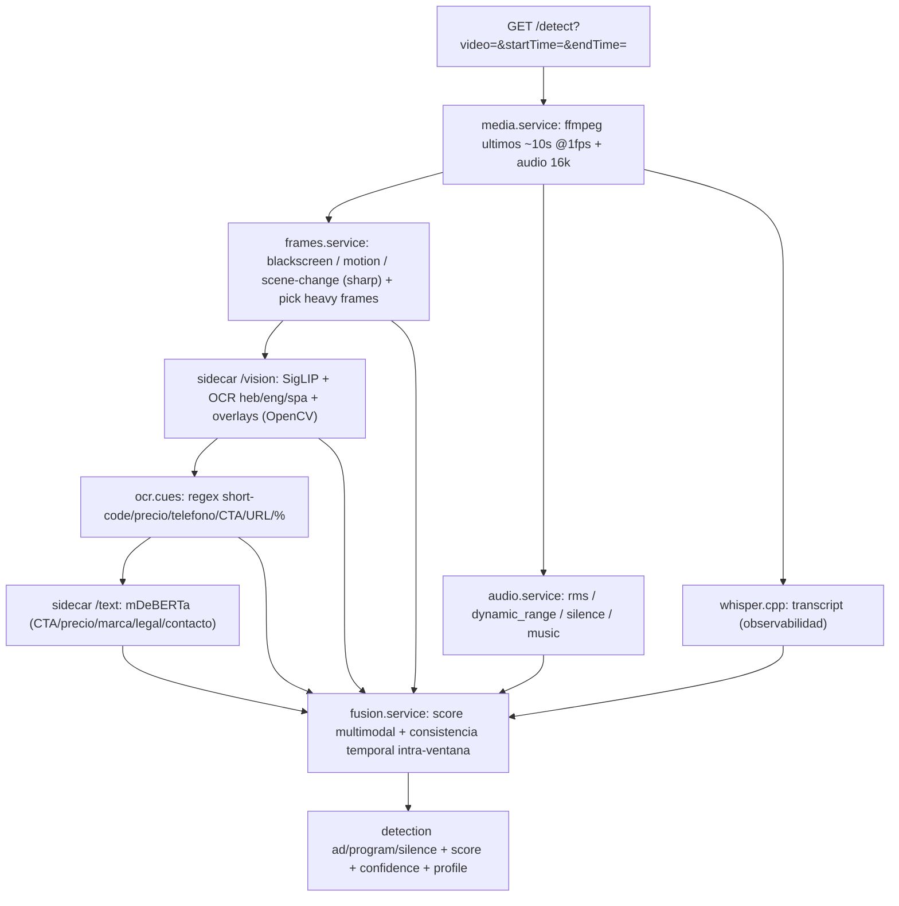

# insight-ad-recognition

API stateless que determina, para una ventana corta de un canal (archive/VOD con `startTime`/`endTime`), si lo que se está reproduciendo es un **comercial (ad)**, un **programa** o un **silencio/hueco**, fusionando una batería de señales CPU multimodales.

Todo corre dentro de **un único contenedor**: la API Node.js orquesta `ffmpeg`, `whisper.cpp` (observabilidad) y un **sidecar Python** que carga:

- **SigLIP** (clasificador visual zero-shot): `programa / publicidad / placa / noticia / deporte / institucional`.
- **Tesseract OCR** (`heb+eng+spa`) + extracción de **cues por regex** (short-codes `*2065`, teléfonos, precios, `%`, URLs, cuotas, keywords promo/CTA en hebreo/español/inglés).
- **Detección de overlays** (OpenCV): zócalos/banners/placas/logos por densidad de bordes y contornos.
- **mDeBERTa** (BERT zero-shot multilingüe): etiquetas semánticas `CTA / precio / marca / legal / contacto / programa`.
- **Métricas de audio locales** (`ffmpeg astats`/`silencedetect`): RMS, silencio, música, habla.

> El clasificador de audio CLAP fue **removido**: clasificaba ads y noticieros como "Sports broadcast" con demasiada frecuencia. El audio ahora aporta solo vía las métricas locales de ffmpeg.

Un **fusion layer determinista** combina todas las señales con consistencia temporal dentro de la ventana y decide `ad | program | silence`.

---

## Endpoint

```
GET /detect?video=<url mp4 o m3u8>[&verbose=1]
```

- `video` **(obligatorio)**: URL de un `.mp4` o `.m3u8`. Para archive/DVR se pasa con `startTime`/`endTime` (el CMS arma la ventana). Si es una master playlist, se elige la rendition de menor resolución.
- `verbose=1`: incluye `profile` completo + `meta` (razones del fusion layer, categorías, frames pesados usados).

### Autenticación

Secret compartido vía `API_SECRET`: header `x-api-secret`, `Authorization: Bearer`, o `?secret=`. Vacío = sin auth.

### Respuesta (compacta)

```json
{
  "detection": "ad",
  "selected": "ad",
  "score": 0.72,
  "confidence": 0.78,
  "scores": { "ad": 0.72, "program": 0.30, "silence": 0.0 },
  "timestamp": 1783610681,
  "took": 5400,
  "transcript": "...",
  "ocr_text": "*2065 ...",
  "visual_category": "publicidad",
  "audio_category": "Advertisement",
  "ocr_ad_cue_count": 3,
  "overlay_present": true,
  "url_image": "https://.../previews/....jpg",
  "profile": { ... }
}
```

`detection` ∈ `"ad" | "program" | "silence"`.

El `profile` (en `verbose` o siempre) trae el desglose completo: métricas de video (`blackscreen_ratio`, `motion_avg`, `scene_change_rate`), audio (`audio_rms`, `silence_ratio`, `music_probability`, `speech_ratio`), visual (`video_category_avg`, `video_per_category`), OCR (`ocr_text`, flags `ocr_short_code`/`ocr_price`/`ocr_phone`/`ocr_cta`/..., `ocr_ad_cue_count`), overlay (`overlay_present`, `lower_third_present`, `banner_present`, `logo_region_present`, `overlay_score`) y texto (`text_category`, `text_labels`).

### `GET /health`

Liveness/readiness (sin auth). Reporta si el sidecar y cada modelo (`siglip/ocr/overlay/text`) están listos.

---

## Pipeline



1. **Extracción**: `ffmpeg` saca ~10 frames (1 fps) + audio 16 kHz (whisper + métricas de audio).
2. **Gates baratos** (`sharp`): blackscreen/motion/scene-change en cada frame y selección de hasta `HEAVY_MAX_FRAMES` frames "interesantes".
3. **Heavy submuestreado**: SigLIP + OCR + overlays solo sobre los frames pesados (no los 10) para no saturar CPU.
4. **OCR cues + BERT**: regex sobre el texto OCR + clasificación semántica multilingüe.
5. **Audio**: métricas locales de ffmpeg (RMS / silencio / música / habla).
6. **Fusión determinista**: pesos transparentes (`config.fusion`). Regla fuerte: `contacto + CTA + marca/precio` o short-code + precio → ad alto. Un **gate de señal sostenida** evita que un frame ruidoso flipee a `ad`.

---

## Estrategia CPU (pocos canales, CPU modesta)

- Gates baratos en cada frame; modelos pesados solo en `HEAVY_MAX_FRAMES` (default 5).
- Semáforo `MAX_CONCURRENT_JOBS` + lock por modelo en el sidecar.
- Ventana corta de 10s (`SEGMENT_SECONDS=10`) → latencia acotada.

---

## Variables de entorno

Ver `.env.example`. Principales: `SEGMENT_SECONDS` (10), `HEAVY_MAX_FRAMES` (5), `SIGLIP_MODEL`, `TEXT_MODEL`, `OCR_LANGUAGES` (`heb+eng+spa`), `AD_MIN_SCORE` (0.35), y los pesos `FUSION_*`.

---

## Build & run (Docker)

```bash
docker build -t insight-ad-recognition .
docker run --rm -p 8081:8081 -e API_SECRET=mi-secreto insight-ad-recognition
```

Tesseract `heb/eng/spa` se instala como paquete de sistema. Los checkpoints (SigLIP + mDeBERTa, ~900MB) se **descargan en el primer arranque** del contenedor (dentro de `HF_HOME`), no se hornean en la imagen — así el build no se queda sin memoria al snapshotar (el builder de DO App Platform tiene RAM limitada). Requiere internet en el primer boot y `/health` reporta el sidecar como no-listo hasta terminar la carga (el scheduler del CMS degrada con gracia mientras tanto).

> Para una imagen **offline** (sin descarga en runtime), buildeá en una máquina/CI con recursos y corré `python3 ml/prefetch.py` en build (o desplegá esa imagen prebuildeada desde un registry). Ver el comentario en el `Dockerfile`.

---

## Notas de diseño

- **Stateless**: el microservicio decide por ventana; el CMS pollea cada 10s pasando el chunk `startTime/endTime` y mantiene su histéresis 3+3 entre ventanas.
- **Consistencia temporal**: intra-ventana (señales promediadas sobre los frames + gate de sostenido) en el microservicio; inter-ventana en el CMS.
- **Multilingüe**: OCR + BERT soportan hebreo/español/inglés.
- **Degradación elegante**: si el sidecar o whisper fallan, la API responde con las señales disponibles y lo refleja en `meta`.
