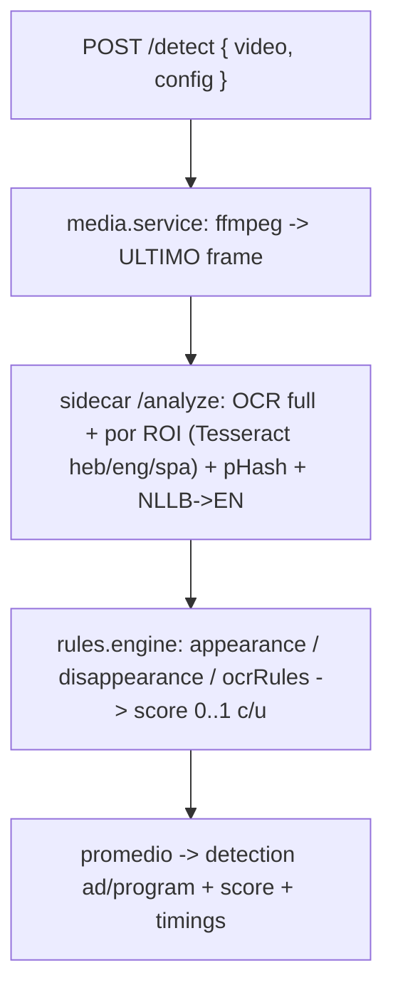

# insight-ad-recognition

API stateless que, para una ventana de archive/VOD de un canal (`startTime`/`endTime`), toma **solo el último frame** y decide si es un **comercial (ad)** o un **programa** evaluando un **motor de reglas configurable por canal**. El CMS marca el pulso (pollea cada ~10s) y envía, junto al video, la config del canal.

Todo corre dentro de **un único contenedor**: la API Node.js orquesta `ffmpeg` (extracción del último frame) y un **sidecar Python** que provee:

- **Tesseract OCR** (`heb+eng+spa`): texto de toda la pantalla y de cada ROI.
- **Perceptual hashing** (`imagehash` / pHash): matching de aparición/desaparición de logo/marca en un ROI.
- **NLLB-200** (Meta): traducción del texto OCR a inglés (hebreo/español → inglés). Se muestran original y traducido en el resumen del escaneo.

> El stack multimodal anterior (SigLIP, mDeBERTa, overlays OpenCV, whisper, CLAP) fue **removido**. La detección ahora es 100% determinista y configurable por canal.

---

## Estrategias (config por canal)

Cada estrategia devuelve un **score 0..1**; el score final es el **promedio de las estrategias activadas** y el veredicto es `ad` cuando alcanza el `threshold` del canal.

1. **Aparición de Marca/Logo** — el logo/marca APARECE en su ROI (pHash contra las muestras y/o match de texto OCR). Varias instancias se evalúan con **OR**.
2. **Desaparición de Marca/Logo** — el logo/marca está AUSENTE de su ROI (la inversa). Varias instancias con **OR**.
3. **Reglas OCR** — condiciones sobre el texto OCR de toda la pantalla. **Grupos** con OR; **condiciones** dentro de un grupo con AND. Operadores: `includes / startsWith / endsWith / similarTo / regex / between / majorTo / minorTo`. Cada condición elige el texto **Original** o **Traducido (EN)**.

---

## Endpoints

### `POST /detect`

```jsonc
// body
{ "video": "<url m3u8/mp4 con startTime/endTime>", "config": { /* config del canal */ } }
```

Respuesta:

```json
{
  "detection": "ad",
  "selected": "ad",
  "score": 0.66,
  "threshold": 0.5,
  "scores": { "logoDisappearance": 1.0, "ocrRules": 0.0 },
  "strategies": { "...": "detalle por estrategia" },
  "strategyResults": { "enabledCount": 2, "timings": { "ffmpegMs": 800, "sidecarMs": 3200 } },
  "ocrText": "...",
  "ocrTextEn": "...",
  "elapsedMs": 4200,
  "timestamp": 1783610681,
  "took": 4300,
  "url_image": "https://.../previews/....jpg"
}
```

`detection` ∈ `"ad" | "program"`.

### `POST /sample`

Analiza una imagen-template subida por el admin y devuelve su pHash + OCR (+ traducción), que el CMS embebe en la config.

```jsonc
{ "imageUrl": "https://..." }   // o { "imageBase64": "data:image/png;base64,..." }
// -> { "phash": "...", "ocrText": "...", "ocrTextEn": "..." }
```

### `GET /health`

Liveness/readiness (sin auth). Reporta si el sidecar (`ocr`, `translator`) está listo.

### Autenticación

Secret compartido vía `API_SECRET`: header `x-api-secret`, `Authorization: Bearer`, o `?secret=`. Vacío = sin auth.

---

## Pipeline



1. **Extracción**: `ffmpeg` guarda solo el último frame de la ventana (`-sseof`/`-live_start_index` + `-update 1`).
2. **Sidecar `/analyze`**: pHash + OCR de cada ROI configurado, OCR de toda la pantalla, y traducción a inglés vía NLLB.
3. **Motor de reglas** (Node): calcula el score de cada estrategia activada y promedia; `ad` si supera el umbral del canal.
4. **Timings**: se reporta el tiempo total (`elapsedMs`) y por etapa (ffmpeg/sidecar) para medir performance.

---

## Variables de entorno

Ver `.env.example`. Principales: `OCR_LANGUAGES` (`heb+eng+spa`), `NLLB_MODEL` (`facebook/nllb-200-distilled-600M`), `FRAME_TAIL_SECONDS` (4), `AD_DEFAULT_THRESHOLD` (0.5), `PHASH_SIZE` (8), `ANALYZE_TIMEOUT_MS`.

---

## Build & run (Docker)

```bash
docker build -t insight-ad-recognition .
docker run --rm -p 8081:8081 -e API_SECRET=mi-secreto insight-ad-recognition
```

Tesseract `heb/eng/spa` se instala como paquete de sistema. El checkpoint de **NLLB-200** se **descarga en el primer arranque** (dentro de `HF_HOME`), no se hornea en la imagen — así el build no se queda sin memoria al snapshotar (kaniko / DO App Platform). Requiere internet en el primer boot; `/health` reporta el sidecar como no-listo hasta terminar la carga (el scheduler del CMS degrada con gracia mientras tanto).

> Para una imagen **offline** (sin descarga en runtime), buildeá en una máquina/CI con recursos y corré `python3 ml/prefetch.py` en build. Ver el comentario en el `Dockerfile`.

---

## Notas de diseño

- **Stateless**: el microservicio decide por frame/ventana; el CMS marca el pulso, envía la config del canal y mantiene su histéresis 3+3 y los segmentos entre ventanas.
- **Multilingüe**: OCR hebreo/español/inglés + traducción NLLB a inglés (para el resumen y para reglas en inglés).
- **Degradación elegante**: si el sidecar falla, la API responde con lo disponible y lo refleja en `meta`.
